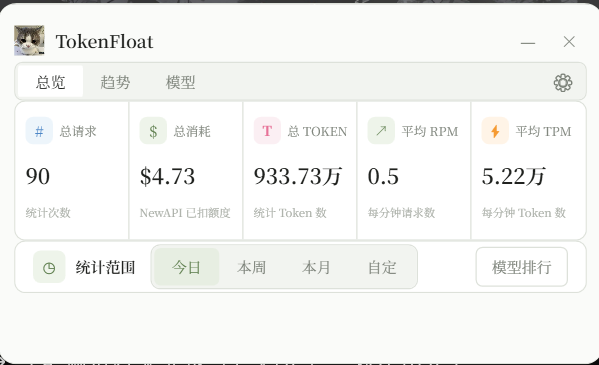
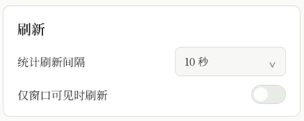

# TokenFloat

[](https://github.com/Dream-Tian/TokenFloat/actions/workflows/build.yml)
[](https://github.com/Dream-Tian/TokenFloat/releases/latest)

TokenFloat 是一个 Windows 桌面悬浮用量面板。它支持 NewAPI 个人消费汇总，以及 Antigravity IDE 本机可读取会话的实际 Token 和当前模型配额，提供用量、速率、趋势和模型排行。

Antigravity 支持属于当前源码的未发布更改，安装包能力请以对应版本的[更新日志](CHANGELOG.md)为准。

## 界面预览

主界面提供总览、趋势、模型和配额四个标签页；设置页集中管理数据来源、刷新策略和本地数据。下图为已有版本的界面示例。

<p align="center">
  
</p>

<p align="center">
  
</p>

## 功能

### 用量分析

- NewAPI 与 Antigravity 可分别启用，也可合并查看已读取的 Token、模型调用和趋势。
- 今日、本周、本月统计，周统计从周一开始计算。
- 任意起止日期统计，并提供近 7 天、近 30 天快捷范围。
- 输入 Token、输出 Token、请求次数，以及所选时段的平均 RPM/TPM。
- Token、消耗和次数趋势切换，悬停图表可查看具体时段数据，点击模型行可只看该模型。
- 今日、本周、本月与上一周期相同进度的用量比较。
- 模型排行榜，展示 Token、请求次数、消耗占比和输入/输出比例。
- NewAPI `quota` 与 `/api/status` 的 `quota_per_unit` 换算估算消耗。
- Antigravity 总输入包含原始输入和缓存读写 Token；输出已含思考 Token，不重复累加。配额比例和重置时间在独立“配额”页显示。
- Antigravity 订阅费用显示为“未计价”；混合来源的金额仅包含已知费用，以 `≥` 标明尚有未计价请求。

### 刷新与缓存

- 刷新间隔可设置为 10 秒、30 秒、1 分钟或 5 分钟。
- 可选择仅窗口可见时刷新。
- NewAPI 首次刷新、缓存缺失或超过 7 天未成功刷新时，默认读取本月和上月；更早日期按需读取。
- NewAPI 常规刷新以最近一次成功抓取为基准，保留 2 小时重叠区间。失败不推进抓取时间，并保留已有记录和换算费率。
- Antigravity 分页读取当前可见会话，空闲且未变化的会话复用本次运行中的扫描结果。
- 两种来源使用独立缓存。Antigravity 只用完整扫描替换成功快照；部分读取不覆盖成功缓存，服务离线时明确标注旧缓存及读取时间。
- 设置页显示本次刷新耗时，可手动清除统计缓存并重建。

### 桌面体验

- 普通模式和迷你模式分别保存窗口位置。
- 可选窗口置顶显示；记住上次选中的标签页、趋势指标、图表样式和模型筛选。
- 双击标题栏切换迷你模式；标题栏整行空白区域也可以拖动窗口。
- 迷你模式显示今日 Token 和今日消耗，并对 Token 新增量播放上浮渐隐动画。
- 系统托盘、单实例运行和可选开机自启。
- 圆角浅色仪表盘界面，设置页使用自定义滚动条。

### 更新与诊断

- 设置页可以测试 NewAPI 连接，显示 HTTP 结果和请求耗时；测试不会保存当前输入内容。
- Antigravity 的“测试配额”只诊断本地服务，不改变已保存的来源开关。
- 支持 HTTPS 更新清单和 SHA-256 安装包校验。
- 下载更新时显示进度、速度，并支持取消。
- 本地错误日志自动清理 14 天前的记录。

## 安装

从 [Releases](https://github.com/Dream-Tian/TokenFloat/releases/latest) 下载 `TokenFloat-Setup-x64.exe`，运行安装器并选择安装目录即可。Release 安装包是自包含版本，不需要另外安装 .NET Runtime。

首次启动后，点击主界面右上角的设置图标，配置需要的数据来源。NewAPI 需填写服务地址和系统 Token；当前源码支持直接读取已运行并登录的 Antigravity IDE，无需为它填写 NewAPI Token。

## NewAPI 配置

设置页的 NewAPI 区域包含以下字段：

| 字段 | 说明 |
| --- | --- |
| 服务地址 | NewAPI 根地址，例如 `https://new-api.example.com/`。程序会请求 `/api/status` 和 `/api/data/self`。 |
| 系统 Token | 用于访问个人消费数据的 Bearer Token。 |
| 用户 ID | 可选；只有服务端要求 `New-Api-User` 请求头时才填写。 |

“测试连接”只请求 `/api/status`，不会保存输入。点击“保存”后刷新统计；NewAPI 地址和认证信息决定其缓存身份，保存相同配置或切换 Antigravity 开关不会清空 NewAPI 历史。

默认完整读取范围覆盖本月和上月。自定义日期早于默认范围时，程序会从指定日期执行完整读取；普通定时刷新仍使用增量策略。

## Antigravity 配置

1. 启动并登录 Antigravity IDE，打开要查看的会话；较早的会话可能需要先在 IDE 中打开才能读取。
2. 在 TokenFloat 设置中勾选“读取 Antigravity IDE 用量和配额”，点击“保存并刷新”。可先点击“测试配额”检查连接。
3. 在总览、趋势、模型和迷你窗口查看实际 Token，在“配额”页查看模型剩余比例及本地重置时间。

统计范围是本地服务当前可读取、已加载的会话，不代表账号全部历史或官方账单。配额测试成功也不保证会话接口提供完整 Token 字段；读取不完整时，面板会显示覆盖提示。详细口径、诊断命令和实测记录见 [Antigravity 使用说明](docs/ANTIGRAVITY.md)。

## 数据与隐私

NewAPI 使用以下接口：

- `GET /api/status`：读取 `quota_per_unit`。
- `GET /api/data/self`：读取个人消费记录，并使用返回的模型、Token、次数和 `quota` 汇总。

Antigravity 通过本机 Language Server 的 `GetUserStatus`、`GetAllCascadeTrajectories` 和 `GetCascadeTrajectoryGeneratorMetadata` 读取配额与调用计数。仅连接匹配进程的回环监听端口，元数据请求设置 `includeMessages: false`；不保存 CSRF 凭证、账号信息、提示词或响应正文。这是对当前 IDE 本地接口的兼容接入，接口可能随版本变化。

本地数据目录默认为 `%LOCALAPPDATA%\TokenFloat`，主要文件如下：

| 文件或目录 | 用途 |
| --- | --- |
| `app-settings.json` | NewAPI 地址、Antigravity 开关、刷新及置顶设置。系统 Token 使用 Windows DPAPI 按当前用户范围加密，旧版明文配置会自动迁移。 |
| `update-settings.json` | 更新源、自动检查设置及检查时间。 |
| `usage-index-v7.json.gz` | NewAPI 事件、换算费率和最近成功抓取时间。 |
| `antigravity-usage-v1.json.gz` | Antigravity 最近完整扫描的事件快照，保存哈希事件标识、模型、调用时间、Token 计数及读取时间。 |
| `logs` | 程序错误日志，记录上下文、异常类型、消息和堆栈。 |

设置页的缓存占用包含两个来源；“清除统计缓存”会清除并重新读取两者。单独保存来源开关不会清除另一来源的缓存。

NewAPI 金额按 `quota` 换算。状态接口暂不可用时沿用该来源最近成功的 `quota_per_unit`，没有已有费率时使用 `500000`；最终账单以你的 NewAPI 部署为准。Antigravity 的 Token、积分和配额比例均不折算订阅费用。

## 从源码运行

环境要求：

- Windows 10/11 x64
- [.NET 8 SDK](https://dotnet.microsoft.com/download/dotnet/8.0)

在仓库根目录执行：

```powershell
dotnet restore
dotnet build TokenFloat\TokenFloat.csproj -c Release -warnaserror
dotnet run --project TokenFloat\TokenFloat.csproj -c Release
```

按已保存来源刷新并输出统计，不打开窗口（成功读取会更新缓存）：

```powershell
dotnet run --project TokenFloat\TokenFloat.csproj -c Release -- --verify-usage
```

单独诊断 Antigravity，输出配额、读取状态及聚合 Token；不改变启用开关，也不写入统计缓存：

```powershell
dotnet run --project TokenFloat\TokenFloat.csproj -c Release -- --verify-antigravity
```

运行自动测试：

```powershell
dotnet test TokenFloat.Tests\TokenFloat.Tests.csproj -c Release -warnaserror
```

## 本地构建安装包

仓库提供了本地 Inno Setup 工具目录；`.tools` 不会提交到 GitHub。

```powershell
dotnet publish TokenFloat\TokenFloat.csproj `
  -c Release `
  -r win-x64 `
  --self-contained true `
  -p:PublishSingleFile=true `
  -p:DebugType=None `
  -p:DebugSymbols=false `
  -o artifacts\publish\win-x64

.tools\InnoSetup6\ISCC.exe installer\TokenFloat.iss
```

安装包输出到 `artifacts\installer\TokenFloat-Setup-x64.exe`。要安装到指定目录，可以使用 Inno Setup 的 `/DIR` 参数，例如：

```powershell
Start-Process artifacts\installer\TokenFloat-Setup-x64.exe `
  -ArgumentList '/DIR=D:\TokenFloat'
```

## 发布流程

版本号同时维护在项目文件、Inno Setup 脚本和示例更新清单中。发布前还需要把 `CHANGELOG.md` 的“未发布”内容改为带日期的版本章节，例如 `## [2.0.6] - 2026-08-10`；标签对应的版本章节缺失或为空时，发布工作流会直接失败。

确认更新日志后，同步版本并执行验证：

```powershell
.\scripts\set-version.ps1 -Version 2.0.6
dotnet build TokenFloat\TokenFloat.csproj -c Release -warnaserror
dotnet test TokenFloat.Tests\TokenFloat.Tests.csproj -c Release -warnaserror

git add -A
git commit -m "Release 2.0.6"
git push origin main
git tag -a v2.0.6 -m "TokenFloat 2.0.6"
git push origin v2.0.6
```

推送 `v*` 标签后，GitHub Actions 会自动执行测试、从 `CHANGELOG.md` 提取对应版本说明、构建自包含安装包、生成 SHA-256 清单并创建 GitHub Release。更新清单使用适合客户端显示的单行变更摘要，GitHub Release 保留完整 Markdown 结构。相关工作流位于：

- `.github/workflows/build.yml`：推送和 Pull Request 的构建与测试。
- `.github/workflows/release.yml`：标签发布、安装包和更新清单。
- `scripts/set-version.ps1`：同步项目版本、安装器版本和示例清单。
- `scripts/get-release-notes.ps1`：提取指定版本的发布说明，并校验版本章节存在且非空。

## 常见问题

### 测试连接失败

确认服务地址是完整的 `http://` 或 `https://` 地址，Token 没有多余空格，并检查服务端是否要求填写用户 ID。设置页状态会显示 HTTP 状态或请求失败原因。

### 有数据但刷新后仍显示旧统计

先查看来源提示是否正在使用离线缓存。可在设置页点击“清除统计缓存”后重新读取；NewAPI 超过 7 天未成功刷新或更改来源后，会重读默认范围。Antigravity 的可读取范围取决于 IDE 当前加载的会话，清缓存不会补齐账号历史。

### Antigravity 有配额，但没有 Token 记录

配额和调用记录来自不同接口。保持 IDE 运行并登录，打开需要统计的会话后刷新；若提示未提供 `usage`、调用时间缺失或读取不完整，当前版本不能据此得出准确总量。请查看 [Antigravity 使用说明](docs/ANTIGRAVITY.md)中的状态解释。

### 金额和账单不一致

TokenFloat 使用 NewAPI 返回的 `quota` 和 `quota_per_unit` 计算估算金额。请检查服务端的分组倍率、模型倍率和补全倍率，最终账单以 NewAPI 为准。Antigravity 显示实际 Token 和剩余配额，其订阅费用不参与估算；`≥` 表示混合来源中仅部分请求有计费信息。

## 项目结构

```text
TokenFloat/               WPF 应用源码、窗口和资源
TokenFloat.Tests/         用量、费用、连接和更新服务测试
installer/                Inno Setup 脚本和更新清单示例
scripts/                  版本与图标维护脚本
docs/                     发布文档和 README 截图
.github/workflows/        GitHub Actions 构建与发布流程
```
